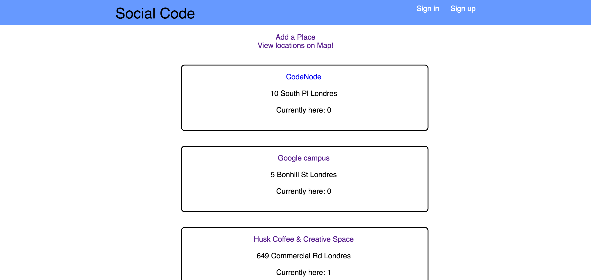
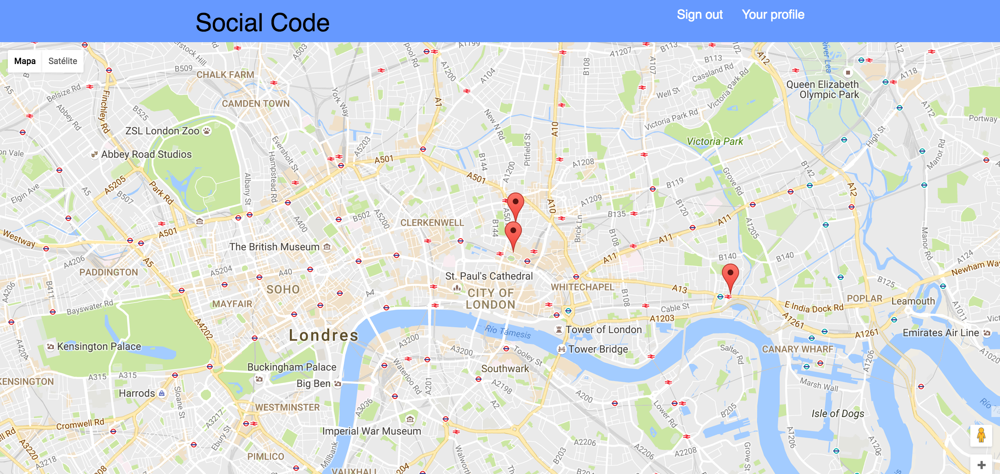
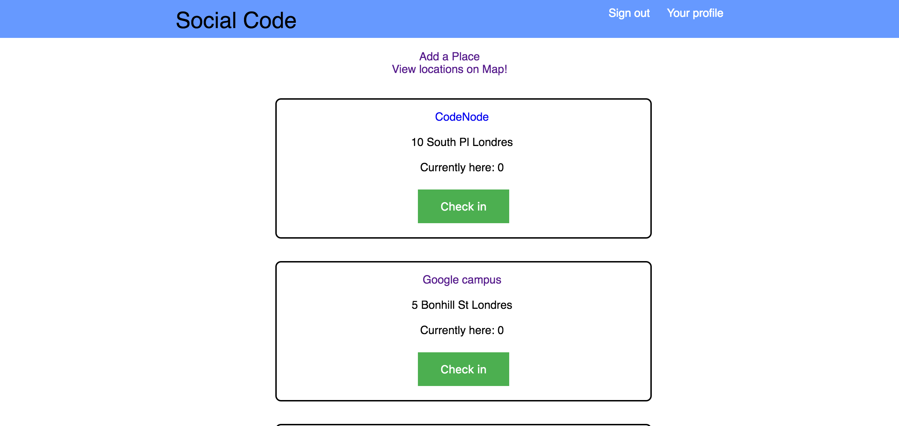
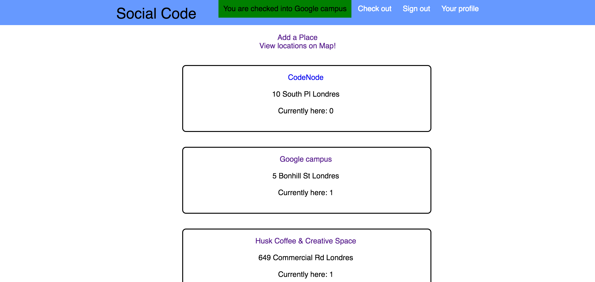

# Social code
Don't code alone.
A web app for developers, to gather and collaborate.

This project is originally the result of one week's work between five people.

## App Description

A web application that allows users to add places that they are coding in public spaces, and to encourage users to meet and code together.

## Screenshots










## Initial Setup

When running this program, you need to enter the following lines on the command-line after cloning/forking:
- bundle
- bin/rails db:create
- bin/rails db:migrate
- bin/rails db:migrate RAILS_ENV=test
- bin/rake db:seed
- bin/rake db:seed RAILS_ENV=test

## Testing framework

All tests throughout the stack are done in Rspec and Capybara.

## Technologies

The application is built using the Google Maps API, Ruby on Rails backend, running with a PostgreSQL database.

# Contributors
- [Carlos] (https://github.com/chdezmar)
- [Hassan] (https://github.com/hassanrad)
- [Jonathan] (https://github.com/jojograndjojo)
- [Ross] (https://github.com/rb2030)
- [Toby] (https://github.com/toby676)

## User Stories
### V1 (MVP)

```
As a potential user
I would like to sign up to Social Code
So that I can create an account
```
```
As a user
I would like to sign in and sign out
So that I can interact with the website
```
```
As a user
I would like to specify my current location
So that I can meet up with other coders
```
```
As a user
I would like to save locations
so that other developers know where to code
```
```
As a user
I would like to see other users location
So that I can meet up with other users
```
### V2

```
As a user
I would like to rate locations
So I can let other users know about their dev friendliness
```
```
As a user
I would like to be able to personalise a user profile
So that I can use Social Code
```
```
As a user
I would like to see other users profile
So I can determine if I can collaborate with them
```
